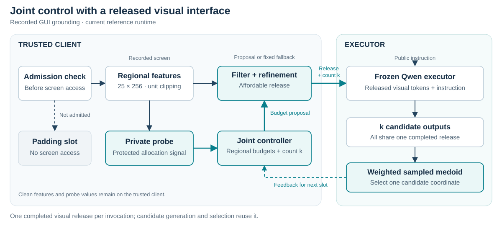

# 🖥️ Blind but Smart

**Joint disclosure-budget and candidate-count control for GUI instruction grounding.**

[](pyproject.toml)
[](pyproject.toml)
[](https://github.com/BitAdventurer/blind-but-smart/actions/workflows/runtime-tests.yml)
[](LICENSE)

A reference implementation for studying how a GUI agent can allocate limited visual disclosure and decoding effort together. A controller chooses regional disclosure budgets and the number of instruction-conditioned candidates; a frozen vision–language executor operates on one shared, noise-refined visual release.

[Overview](#-overview) · [Quick Start](#-quick-start) · [Usage](#-usage) · [Runtime Guide](docs/NAACL_RUNTIME.md) · [Scope](#-scope-and-reproducibility)

## 📌 Overview

GUI grounding asks an agent to locate the screen element described by an instruction. This project studies two coupled decisions: **how much visual evidence to release** and **how many output candidates to generate from that evidence**.

<p align="center">
  
</p>

The admission check precedes private screen access. An admitted step uses a private probe to guide allocation, then creates a Gaussian-refined release. All candidates at that step share this release. Candidate selection combines output likelihood, instruction relevance, and weighted-medoid aggregation.

The workflow evaluates **recorded screens**. Predicted coordinates are scored against held-out annotations; the CLI does not interact with a live desktop.

## ✨ Key Features

- **Joint resource control:** learn regional disclosure budgets and candidate counts with H; compare with CB and separately fitted Independent controllers.
- **Accounted visual release:** 25 regions, separate probe/refinement noise, admission filtering, budget exhaustion handling, and a fixed 56-slot transcript.
- **Released-input execution:** fit a visual projection and language LoRA, then freeze the Qwen executor during controller fitting and evaluation.
- **Deterministic candidate selection:** float64 relevance scoring and weighted-medoid aggregation, with explicit prompt and candidate records for replay.
- **Traceable training:** immutable replay inputs, configuration and input hashes, per-component update counters, and resumable checkpoints.
- **Automated software checks:** CPU tests covering privacy accounting, selection, prompts, tiny Qwen integration, fitting, controller updates, and resume behavior.

## 📁 Project Structure

```text
blind-but-smart/
├── README.md
├── LICENSE
├── pyproject.toml                   # Package, dependencies, and bbs command
├── configs/
│   └── naacl_reference.json          # Explicit reference training settings
├── docs/
│   ├── NAACL_RUNTIME.md              # Full commands, schemas, and contracts
│   └── assets/runtime-overview.svg
├── src/gui_joint_control/
│   ├── cli.py                       # Fitting, collection, training, and smoke
│   ├── features.py                  # Regional DINO features and projection
│   ├── privacy.py                   # Probe, refinement, and budget ledger
│   ├── executor.py                  # Frozen released-input Qwen execution
│   ├── fitting.py                   # Projection alignment and LoRA fitting
│   ├── controller.py / trainer.py   # H, CB, and Independent controllers
│   ├── replay.py / runtime.py       # Immutable replay and trajectory execution
│   └── scoring.py / prompt_policy.py
├── tests/                           # CPU software tests
└── .github/workflows/               # Continuous integration
```

## 🚀 Quick Start

### 1. Clone and create an environment

Use Python **3.11 or newer**; CI uses Python 3.12.

```bash
git clone https://github.com/BitAdventurer/blind-but-smart.git
cd blind-but-smart
python -m venv .venv
```

Activate the environment for your shell:

```bash
# Linux / macOS
source .venv/bin/activate
```

```powershell
# Windows PowerShell
.\.venv\Scripts\Activate.ps1
```

### 2. Install and check

Install a PyTorch build appropriate for your CPU or CUDA device, then install the project:

```bash
python -m pip install -e ".[vlm,test]"
bbs --help
python -m pytest tests
```

The VLM integration pins `transformers==4.57.6` and `peft==0.18.1`.

### 3. Run the CPU smoke check

```bash
bbs smoke --output runs/software-smoke --updates 3
```

This checks collection, replay, three controller updates, and checkpoint writing using a **synthetic software fixture**. It requires no benchmark data or 7B model download and does not produce a benchmark score. Use a fresh output directory each time.

## 🗂️ Data and Model Preparation

Datasets and model weights are supplied separately. Keep local inputs under `data/`, model snapshots under `models/`, and generated artifacts under `runs/`; these directories are ignored by Git.

| Workflow | Required inputs |
|---|---|
| Projection alignment | NPZ with trusted `[N,25,256]` features and aligned native visual targets |
| Task adapter fitting | JSONL with feature paths and canonical prompt/target token IDs; pinned base model and projection |
| Grounding collection/evaluation | JSONL manifest with trajectory, slot, instruction, eligibility, target box, and feature or image path |
| Controller fitting | Immutable replay NPZ produced by behavior collection, plus the reference configuration |

Example Grounding manifest record:

```json
{"trajectory_id":"train-001","slot":0,"task":"G","instruction":"Click the Save button.","target_box":[0.10,0.20,0.16,0.25],"features_path":"features/train-001-00.npy","eligible":true}
```

Feature paths are relative to the manifest; coordinates are normalized to `[0,1]`. Target boxes are used for offline scoring and rewards, not as executor or allocator inputs. Training and evaluation must use separate fixed manifests.

See the [runtime guide](docs/NAACL_RUNTIME.md) for complete schemas, screenshot encoding options, tokenizer binding, and model revision requirements. Native visual alignment targets must be prepared before Stage 1.

## ⚙️ Usage

### Workflow entry points

| Step | Command | Purpose |
|---|---|---|
| 1 | `bbs fit-projection` | Align regional features to precomputed native visual targets |
| 2 | `bbs fit-adapter` | Fit the projection and language query/value LoRA |
| 3 | `bbs collect-grounding` | Collect behavior records with the frozen executor |
| 4 | `bbs train` | Fit a controller from the immutable replay |
| 5 | `bbs collect-grounding --controller-checkpoint ...` | Evaluate a frozen controller on a separate manifest |

Run each command with `--help` for its arguments. The [runtime guide](docs/NAACL_RUNTIME.md) provides the complete ordered workflow.

### Train a controller

After behavior collection has created `runs/behavior/replay.npz`:

```bash
bbs train --config configs/naacl_reference.json --replay runs/behavior/replay.npz --method H --updates 1000000 --batch-size 256 --device cuda --output runs/H-f1
```

| Method | Controller structure | Example updates per component | Aggregate component iterations |
|---|---|---:|---:|
| `H` | Joint disclosure and count control | 1,000,000 | 1,000,000 |
| `CB` | Joint controller with zero discount | 1,000,000 | 1,000,000 |
| `Independent` | Two separately fitted controllers | 500,000 | 1,000,000 |
| `Independent-1M` | The same two-controller structure | 1,000,000 | 2,000,000 |

`--updates` is required and means **additional iterations per component**, including on resume. Each Independent component is fitted with a fixed complementary decision; learned heads are composed for evaluation without joint fine-tuning. Method names do not automatically set the update count.

### Evaluate a frozen controller

Use the merged adapter model with its corresponding projection and the original tokenizer snapshot:

```bash
bbs collect-grounding --manifest data/test.jsonl --model runs/task-adapter/merged_model --tokenizer models/qwen-base --projection runs/task-adapter/projection.npy --controller-checkpoint runs/H-f1/checkpoint.pt --controller-config configs/naacl_reference.json --controller-method H --training-replay runs/behavior/replay.npz --output runs/H-f1-eval-r1 --device cuda --dtype bfloat16
```

The training replay validates checkpoint binding; it is not updated during evaluation. Accuracy uses all eligible examples, with invalid and budget-exhausted outputs scored as zero. The merged-model export does not include tokenizer files, so the separate tokenizer path is required.

## 🔧 Reference Configuration

The controller profile is defined in [`configs/naacl_reference.json`](configs/naacl_reference.json). The [execution contract](docs/NAACL_RUNTIME.md#6-selection-prompt-and-privacy-contracts) documents scoring and privacy constants.

| Setting | Reference value |
|---|---|
| Screen representation | 25 regions × 256 dimensions |
| Controller observation | 28 dimensions |
| Controller hidden layers | Two 128-wide ReLU layers |
| Candidate count | 1–20 |
| Executed regional budget | 1.5–5.0, including probe cost 1.0 |
| Public trajectory cap | `75 × eligible slots`, at most 4,200 |
| Transcript length | 56 slots |
| Controller optimizer | Adam, learning rate `3e-4` |
| Discount | H: `0.99`; CB: `0.0` |
| Replay batch size | 256 |

The default architecture has **133,706 controller parameters for H/CB** and **258,382 for Independent**, including target critics. These are counts for this implementation; the default comparison is not capacity-matched.

## 📊 Outputs

| Artifact | Contents |
|---|---|
| `run.json` | Run identity, software versions, input hashes, and stage-specific measurements |
| `transcript.jsonl` | Fixed-slot ledger records and local offline correctness labels |
| `candidates.jsonl` | Prompt/scoring token IDs, decoder seeds, candidate records, and selected index |
| `releases/` | Completed visual refinement arrays |
| `replay.npz` | Trusted controller observations and transitions from behavior collection |
| `modules.json`, `training.jsonl` | Instantiated controller counts and optimization records |
| `checkpoint.pt` | Controller, optimizer, target, sampler, and random-state data for resuming |

Outputs depend on the selected stage. Treat replay arrays and private randomizer state as trusted local artifacts. The complete evaluation log contains labels and is not a certified public mechanism transcript.

## 🔬 Scope and Reproducibility

This repository is a **new implementation of the documented mechanism**, not recovered source for historical paper measurements. New experiments require their own checkpoints, run identifiers, parameter counts, timings, and accuracy measurements. Tests and the smoke check validate software behavior; they do not reproduce full-scale benchmark results.

| Capability | Current coverage |
|---|---|
| Recorded Grounding collection/evaluation | Implemented; retrieval disabled |
| Projection and task-adapter fitting | Implemented; Stage 1 uses precomputed native targets |
| H, CB, and Independent fitting/resume | Implemented from immutable replay |
| Action parsing and aggregation | Library utilities; no complete Action benchmark CLI |
| Live desktop interaction | Not implemented |
| Development checkpoint selection and 10-family × 3-replicate orchestration | Not automated; CLI saves the last controller checkpoint |

Privacy calibration uses sensitivity `0.01` for the stated **feature neighborhood with fixed public inputs**. It does not cover arbitrary screenshot pairs or provide training-record privacy, and the numerical implementation is not a production DP certification. Candidate weights use signed relevance squared; this measures score magnitude rather than exclusively positive semantic alignment.

For experiment reporting, retain the repository commit, model/tokenizer revisions, manifests, projection hashes, configurations, and family/replicate identifiers. Earlier experimental code remains accessible in [Git history](https://github.com/BitAdventurer/blind-but-smart/tree/c13776d184250d55f008afb76658f5a02cbcf120).

## 📄 License

Released under the [MIT License](LICENSE).
