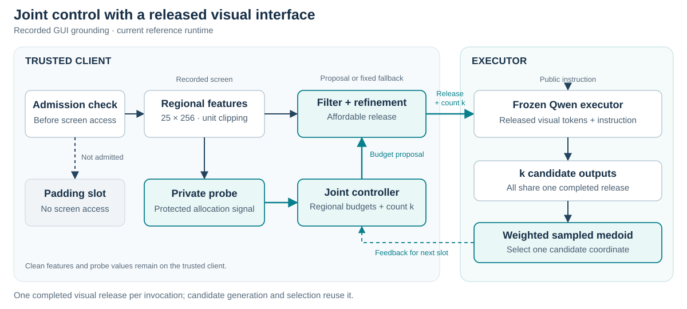

# 🖥️ Blind but Smart

**Joint disclosure-budget and candidate-count control for GUI instruction grounding and action prediction.**

[](https://github.com/BitAdventurer/blind-but-smart/actions/workflows/runtime-tests.yml)
[](LICENSE)

This runtime implements the current author-specified JDC controller and recorded-screen execution contracts. A controller chooses regional disclosure budgets and candidate count; a frozen Qwen2.5-VL executor uses one shared refinement release. The implementation supports new experiments. It does not recover historical weights or establish reproduction of reported measurements.

<p align="center"></p>

Admission precedes private screen access. The probe guides allocation, fresh Gaussian noise creates the refinement, and every candidate and retrieval query uses that completed release. The code evaluates recorded screens; it does not operate a live desktop.

## Implemented workflow

The [recorded metadata evaluator](experiments/README.md) provides Appendix G's pair/record bootstrap, explicit analyzed sample counts, and machine-readable calculation provenance.
The [published-aggregate companion](paper_aggregates/analysis/README.md) checks
the supplied C.6, C.7, D.6 and F.5 table arithmetic with Python's standard library.

- Projection alignment and task-specific language q/v LoRA fitting.
- H, H-ActorTMS, CB, Disclosure-only, Count-only, Independent and Independent-1M controllers.
- Immutable replay, explicit development-derived TMS schedules, resumable optimizer/RNG checkpoints.
- Development selection every 10,000 iterations, with separate selected and last states.
- Released-input Grounding and Action execution; Action requires a supplied frozen schema and pinned evaluator.
- Frozen Train-only retrieval, global public exclusion views and release-only queries.
- Explicit ten-family controller plans and three evaluations per fitted checkpoint.
- Validated dataset preparation from supplied records and trajectory split assignments.
- Pinned official downloads and raw GUI-360/ScreenSpot-v2 conversion.
- Fit-train input generation for projection alignment and teacher-forced adapters.
- Transcript-verified run summaries with explicit metric denominators and runtime bindings.
- Failure traces preserving completed disclosure and explicit retained prompt-source identifiers.

Read the [runtime guide](docs/NAACL_RUNTIME.md), [Action and retrieval schemas](docs/action-retrieval.md), [family protocol](docs/MANUSCRIPT_PROTOCOL.md), and [alignment notes](docs/MANUSCRIPT_ALIGNMENT.md).

## Prepare inputs and export results

Start with [official downloads and conversion](docs/upstream-data.md), then
[projection/adapter input generation](docs/training-inputs.md). GUI-360 downloads
require explicit file patterns. ScreenSpot remains evaluation-only.

The [dataset preparation guide](docs/dataset-preparation.md) defines normalized
Grounding/Action records and an explicit `train`/`dev`/`test` trajectory assignment.
Preparation validates labels, coordinate units, paths and split overlap, excludes
whole trajectories beyond 56 slots, and records source/manifests hashes and counts.

```bash
bbs prepare-dataset --records supplied/records.jsonl --splits supplied/splits.json --task G --output data/prepared-G
# Run an evaluation with the fitted artifacts described below, then summarize it:
bbs summarize-run --run-directory runs/H-test --output reports/H-test.json
```

The [run summary guide](docs/run-report.md) lists metrics and denominators.
Summaries verify the transcript hash, complete slot grid, identities, outcome
counts and budget ledger. They export aggregates and recorded bindings; prompt
text, predictions, private-input hashes and local paths stay in the local run.
Use new output paths for both commands.

## Install and check

Use Python 3.11+ (CI uses 3.12), create a virtual environment, and install an appropriate CPU/CUDA PyTorch build. Then:

```bash
python -m pip install -e ".[data,vlm,test]"
bbs --help
python -m pytest tests -q
bbs smoke --output runs/software-smoke --updates 3
```

Smoke uses synthetic data and three CPU controller updates. It downloads no model weights and produces no benchmark score. Use a new output directory. VLM integration pins Transformers 4.57.6 and PEFT 0.18.1. Tiny Qwen tests instantiate small random models only as software fixtures.

The default controller configuration is included in installed packages, including wheels. Use full option names; abbreviated options are rejected. The repository's `configs/naacl_reference.json` remains available for explicit `--config` bindings.

## Current controller specification

| Setting | Value |
|---|---|
| Screen / observation / critic input | 25×256 / 28 / 73 dimensions |
| H, CB and standalone hidden layers | Two 256-wide ReLU layers |
| Independent hidden layers | Separate two-layer 170-wide networks per role |
| Initialization | Hidden Kaiming-uniform/ReLU, output Xavier-uniform, zero biases |
| Optimizer | AdamW; lr 3e-4; betas (.9,.999); eps 1e-8; weight decay 0 |
| Update order | Joint twin-critic step → actor step → Polyak 0.005 |
| Gumbel temperature | max(.10, 1 − .90 n / 500000), completed iterations n starts at 0 |
| Evaluation | Budget means and smallest count argmax; no Gumbel |
| Discounts | H .99; CB bootstrap 0; checkpoint return .99 |
| Replay | Immutable; capacity 1M; 70/30 success/failure; batch256 |
| Numeric rules | Float32 controller/optimizer; float64 density and accounting |

| Controller | Online | Targets | Total stored |
|---|---:|---:|---:|
| H / H-ActorTMS / CB | 261,192 | 169,986 | 431,178 |
| Independent, both components | 247,254 | 167,284 | 414,538 |

Counts exclude frozen vision/language models and projection. Independent is not exactly capacity- or compute-matched to H. The old 128-wide/Adam profile and version1 checkpoints are rejected rather than silently relabeled.

## Inputs and example commands

Supply data, immutable model/tokenizer snapshots, fitted projection and adapter weights separately. Keep them in ignored `data/`, `models/` and `runs/`. Example Grounding row:

```json
{"trajectory_id":"train-001","slot":0,"task":"G","instruction":"Click Save.","target_box":[0.1,0.2,0.16,0.25],"features_path":"features/train-001-00.npy","eligible":true}
```

Feature files have shape [25,256]. Paths are relative to the manifest. Train and development must have disjoint trajectory IDs. Reference targets enter offline scoring only.

The full retrieved method requires bank/key artifacts, a development-selected threshold and complete public exclusion metadata. `--disable-retrieval` is an explicit ablation. The following **retrieval-disabled** examples assume all fitted artifacts already exist:

```bash
bbs collect-grounding --manifest data/train.jsonl --model models/fitted-G --tokenizer models/qwen-base --projection models/projection-G.npy --family-id f1 --disable-retrieval --output runs/G-f1-behavior
bbs train --config configs/naacl_reference.json --replay runs/G-f1-behavior/replay.npz --method H --updates 1000000 --family-id f1 --task G --dev-manifest data/dev.jsonl --model models/fitted-G --tokenizer models/qwen-base --projection models/projection-G.npy --disable-retrieval --output runs/G-f1-H
bbs collect-grounding --manifest data/test.jsonl --model models/fitted-G --tokenizer models/qwen-base --projection models/projection-G.npy --family-id f1 --replicate-id 1 --split test --disable-retrieval --controller-checkpoint runs/G-f1-H/selected.pt --controller-config configs/naacl_reference.json --training-replay runs/G-f1-behavior/replay.npz --output runs/G-f1-H-r1
```

These are examples, not commands run by installation. For VLM execution on suitable hardware add `--device cuda --dtype bfloat16`. The author reports one RTX 5090 for the paper; CPU software checks do not establish performance or memory use on that GPU.

Independent uses 500k additional iterations per component (1M aggregate); Independent-1M uses 1M per component (2M aggregate). Both require a training TMS artifact derived from the paired selected H development trace. Standalone methods also need population-specific development and evaluation TMS schedules.

H-ActorTMS retains H's architecture, joint critic/target and joint evaluation.
Each head's actor improvement uses the other head's fixed TMS setting. Supply
`--tms-schedule` for training and checkpoint loading. The
[matched-pair protocol](docs/MANUSCRIPT_PROTOCOL.md#h--h-actortms-matched-reruns)
pairs initialization and replay sampling in new reruns.

## Outputs and scope

`selected.pt` is selected on development return; `last.pt` is the latest resumable state. `selection.json` records checksums and evaluations. Selected development traces are exported for TMS construction. A run shorter than the first 10k interval has no selected model.

Evaluation writes provenance, fixed-slot local records, candidates and completed releases. It records the applied prompt cap/history policy and renderer/scoring code hashes, actual model device/precision, package versions, OS, Unicode and CUDA/cuDNN metadata. A failed invocation preserves the completed release, earlier trajectories and an artifact-bound `aborted.json`; failed runs cannot be summarized as completed evaluations. Behavior collection also writes immutable replay with slot/task/family/source-manifest bindings. Local logs contain labels. Replay, private-input hashes and private randomizer states are trusted local artifacts, not protected public mechanism output.

The family planner starts with supplied frozen family/task executors; it does not itself establish ten complete executor refits. Callers supply normalized benchmark records, trajectory splits, official Action schema/scorer and any same-screen population. The preparation command preserves these inputs and execution records their bindings. This runtime contains no prepopulated benchmark scores.

Privacy calibration uses sensitivity .01 for the stated feature neighborhood with fixed public inputs. It does not cover arbitrary screenshot pairs or training-record privacy. Research floating-point randomizers are not production DP certification. Signed relevance is squared for Grounding weights, so weighting measures magnitude rather than exclusively positive alignment.

Released under the [MIT License](LICENSE).
